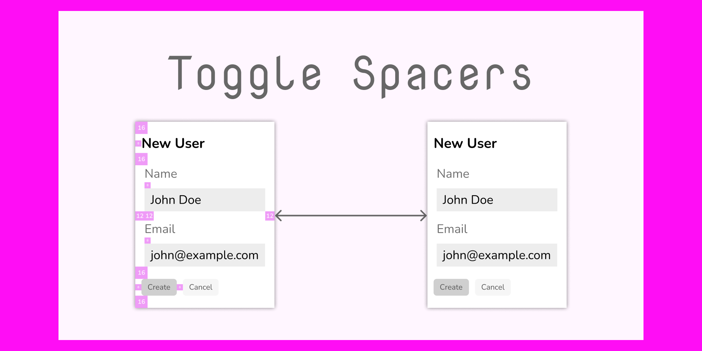

# Toggle Spacers

Toggle all your spacers with ease.

How to use this plugin:

- Create a dedicated page for your spacer components and name it `Spacers`. Make sure this page only contains your spacer components and nothing else
- Use your spacers freely, even in auto layouts (they will still occupy their space when hidden)
- Toggle the visibility by using the `Toggle Spacers → All` command (say via the context menu)

If you want your spacers page to be named differently you may use the the `Toggle Spacers → Select Page` command to select a different page containing your spacers.

While similar plugins hide the actual instances of your spacer components, this plugin actually changes the components itself. This means that either all or no spacers will be visible at any given time.
